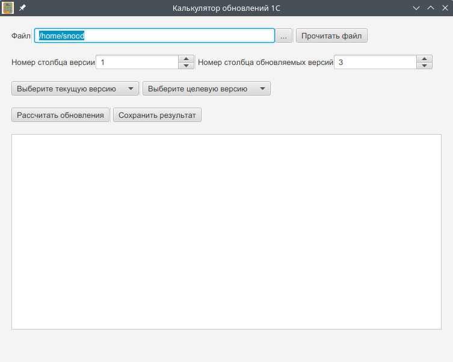

# Калькулятор обновлений 1С


JavaFX-приложение для автоматического расчёта последовательности обновлений конфигураций 1С по таблице Excel.

## Интерфейс



---

## Возможности

* Загрузка и парсинг Excel-файлов с версиями. Проще всего скопировать в Excel таблицу релизов с сайта [releases.1c.ru](https://releases.1c.ru) для своей конфигурации. 
* Автоматический подбор минимальной цепочки промежуточных обновлений между двумя версиями
* Графический интерфейс на JavaFX (FXML)
* Модель версий с валидацией и сортировкой
* Генерация результирующего списка обновлений
* Сохранение результатов в файл

---

## Запуск

### Через Gradle

```bash
./gradlew run
```

### Через исполняемый файл

После сборки через `jpackage` вы можете запускать:

* `.exe` (Windows)
* `.deb`, `.rpm`, или `app-image` (Linux)

---

## Сборка

### Стандартная сборка через jlink

Создаёт модульный образ Java-приложения с JavaFX:

```bash
./gradlew jlink
```

* Выходной каталог: `build/image`
* Используется: JavaFX 21, JDK 21

---

### Сборка установщика через jpackage

Создаёт платформенно-зависимые пакеты: `.exe`, `.deb`, `.rpm`, `.pkg`, `app-image`.

```bash
./gradlew jpackage [-PinstallerType=тип]
```

#### Варианты `installerType`:

| Тип         | Команда                                  | Платформа      |
|-------------|------------------------------------------|----------------|
| `app-image` | `./gradlew jpackage` *(по умолчанию)*    | Все платформы  |
| `exe`       | `./gradlew jpackage -PinstallerType=exe` | Windows        |
| `deb`       | `./gradlew jpackage -PinstallerType=deb` | Linux (Debian) |
| `rpm`       | `./gradlew jpackage -PinstallerType=rpm` | Linux (RHEL)   |
| `pkg`       | `./gradlew jpackage -PinstallerType=pkg` | **macOS**      |

> Сборка под **macOS (`.pkg`) теоретически поддерживается**, но **не тестировалась**.  
> Требуется установленный Xcode и (опционально) код-подписывающий сертификат от Apple.

*Выходной каталог:* `build/jpackage/`

---

## Требования

### Для запуска приложения

При использовании jlink/
jpackage все зависимости (включая JavaFX) вшиваются.
Дополнительные компоненты не требуются.

### Для сборки

* JDK 21
* Gradle 8
* Linux:

  * `dpkg`, `fakeroot` (для .deb)
  * `rpm` (для .rpm)

---

## Структура проекта

```plaintext
update-calculator-1c/
├── src/
│   ├── main/
│   │   ├── java/io/github/snood21/update_calculator_1c/
│   │   │   ├── Release.java              # Модель обновления
│   │   │   ├── Version.java              # Обработка версий
│   │   │   ├── UpdateCalculator.java     # Логика расчёта
│   │   │   ├── UpdateCalculatorApp.java  # Точка входа JavaFX
│   │   │   └── MainFormController.java   # FXML-контроллер
│   │   └── resources
│   │       ├── icons/                    # Иконки
│   │       └── mainform.fxml             # JavaFX UI
├── build.gradle.kts                      # Скрипт сборки
├── LICENSE                               # Лицензия Apache 2.0
├── THIRD_PARTY_LICENSES.md               # Сторонние лицензии
├── README.md                             # Этот файл
└── .github/workflows/build.yml           # CI через GitHub Actions
```

---

## CI/CD: GitHub Actions

Автосборка при каждом push/
PR:

* `.github/workflows/build.yml`
* Java 21
* Gradle Wrapper
* `./gradlew clean jpackage`

Готовые артефакты: раздел **Actions** на GitHub

---

## Лицензия

Код этого проекта распространяется под лицензией [Apache License 2.0](LICENSE).

Сторонние зависимости:

- Apache POI — лицензия Apache 2.0
- JetBrains Annotations — лицензия Apache 2.0

Подробности — в [THIRD_PARTY_LICENSES.md](THIRD_PARTY_LICENSES.md)

---

## Загрузка

Скачайте последнюю версию с [GitHub Releases](https://github.com/snood21/update_calculator_1c/releases)
